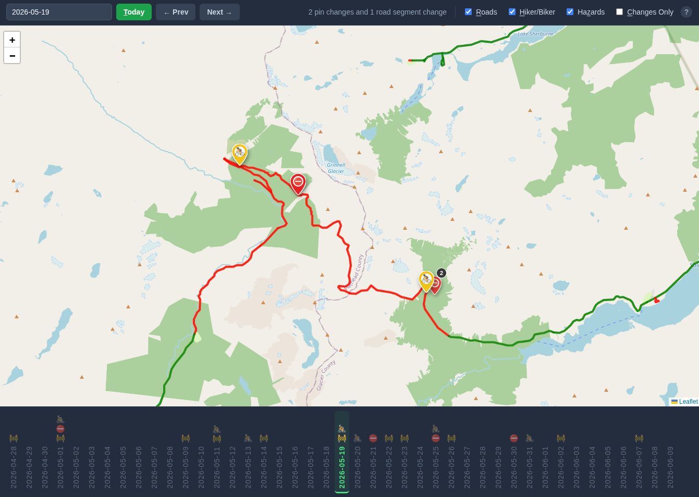

# glacier-road-map-status
Django driven app to retrieve daily Glacier National Park road status, hiker/biker icons and save to a local sqlite DB so we can see changes over time

## Screenshots



## Features

- Retrieve new geojson data daily
- Client UI to view historical data on a map
- Show timeline with status updates

## Setup
```shell
uv python install 3.12
uv init -p 3.12
uv add django requests
```

## Server

Retrieve new geojson data on a schedule, store in `glacier_data.db` SQLite db file

### Scheduler

```shell
crontab -e
```

```shell
# Get new data daily
0 3 * * * cd /path/to/glacier-road-map-status && /usr/bin/python fetch_data.py
```


## Client

### Run client locally

```shell
uv run python manage.py runserver
```

Open browser at http://127.0.0.1:8000/


## Other tools & options

### `.env` file

Define domain/IP if retrieving the SQLite DB from an external server

```shell
SERVER=<IP or hostname>
```

### `client_ui` shell script

Development script to run the client

```shell
./client_ui
```

### `update_db` shell script
Development script to copy the DB from an external server 

```shell
./update_db
```

### `generate_dummy_data.py`
Development script to generate sample data to populate the timeline

```shell
uv run generate_dummy_data.py
```
